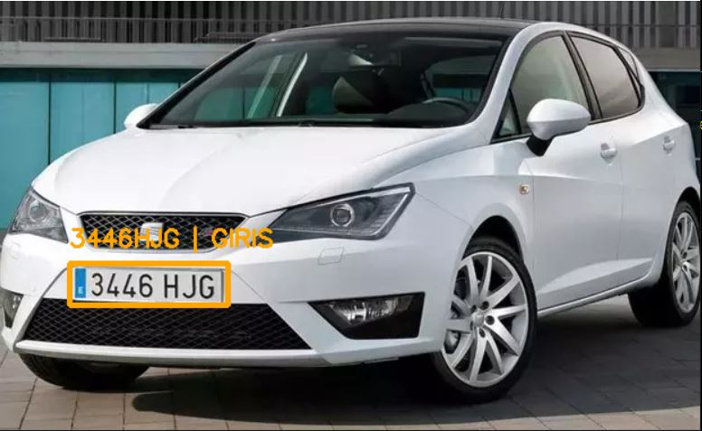
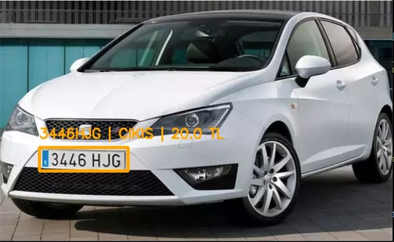
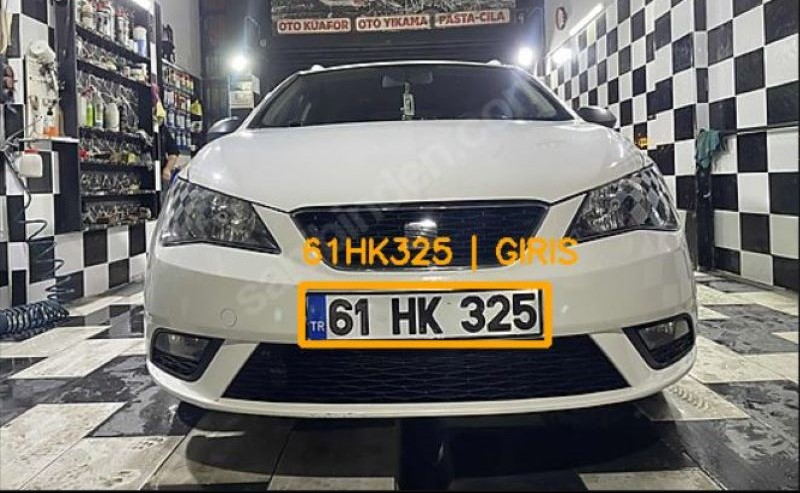
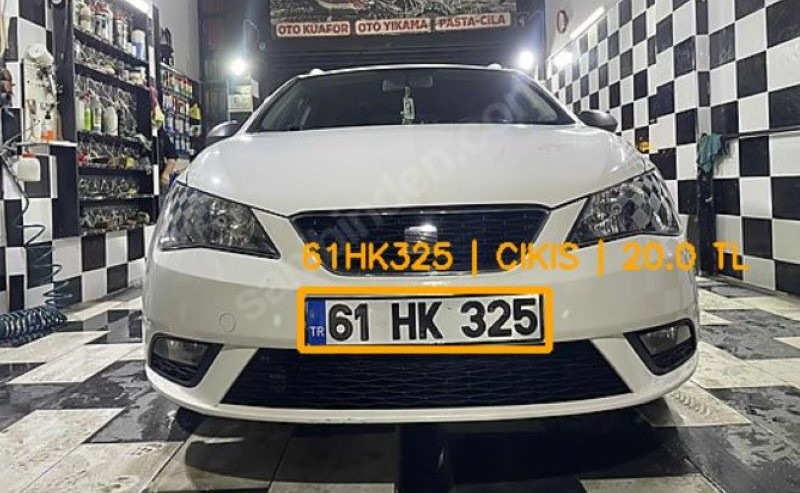
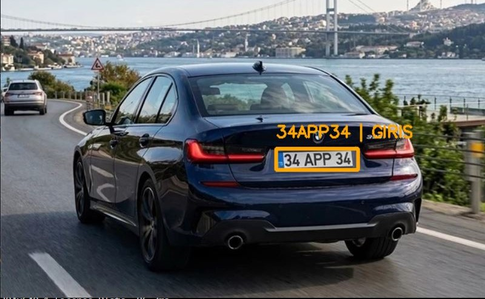
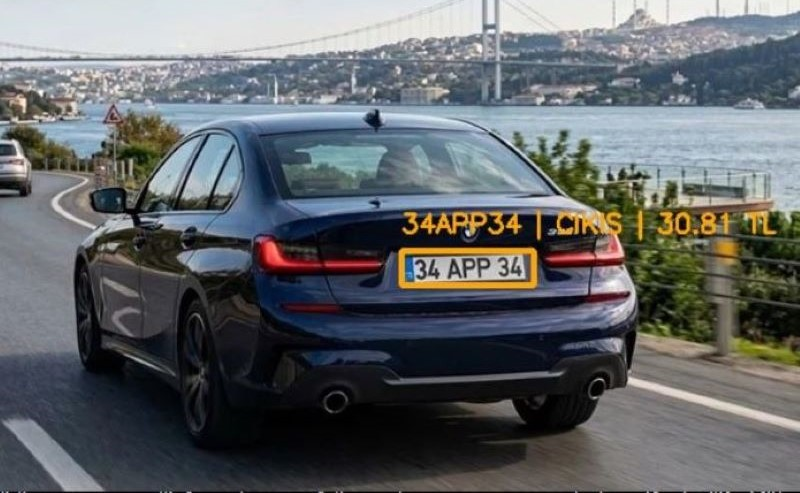
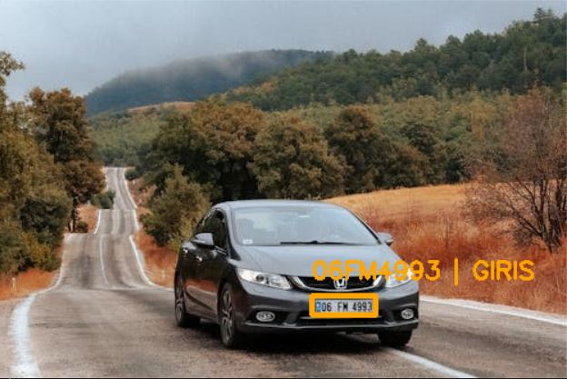
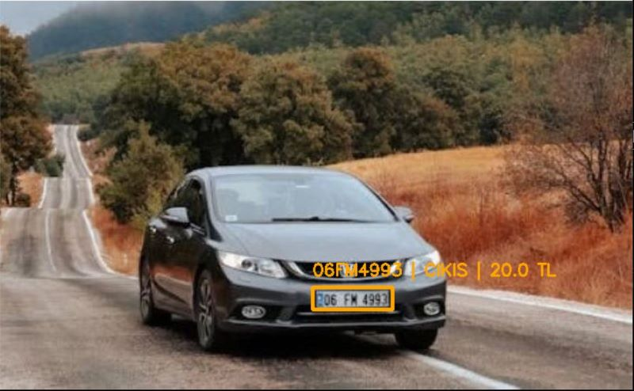
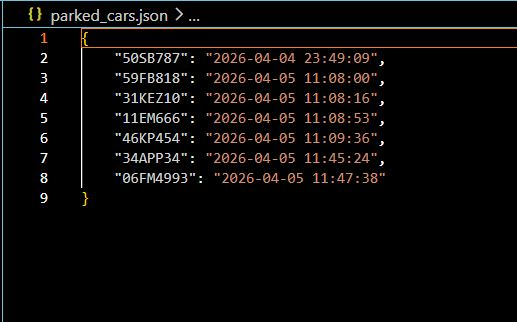
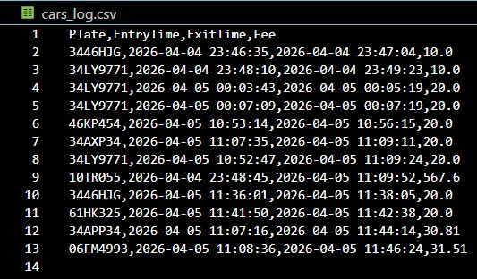

# 📝 Smart Parking Management and ALPR System 
Bu proje; YOLOv8 tabanlı nesne tespiti, [Fast-Plate-OCR (ONNX)](https://fastplateocr.com) ile yüksek hızlı karakter tanıma ve JSON/CSV tabanlı dinamik otopark yönetim mantığını birleştiren bir çözümdür.

## 🚀 Özellikler
- **Özel Eğitilmiş YOLOv8 Modeli:** Roboflow üzerinden 1000+ etiketli görsel ile plaka tespiti için optimize edildi.

- **Yüksek Hız OCR:** Standart OCR kütüphanelerine göre 5 kat daha hızlı ONNX tabanlı Fast-Plate-OCR entegrasyonu.

- **Giriş-Çıkış Takibi:** Araçların giriş ve çıkış anlarını yakalayan akıllı state-machine yapısı.

- **Otomatik Ücret Hesaplama:** İçeride kalınan süreyi (dakika bazlı) hesaplayıp ücretlendiren finansal modül.

- **Veri Kalıcılığı:** parked_cars.json ile anlık içerideki araçlar, cars_log.csv ile tüm geçmiş kayıtların tutulması.

## 🧠 Model Eğitimi (Training Details)
Bu projenin kalbi olan plaka tespit modeli, Transfer Learning tekniği kullanılarak eğitilmiştir.

- **Dataset:** [Roboflow License Plate Recognition](https://universe.roboflow.com/roboflow-universe-projects/license-plate-recognition-rxg4e)
    
- **Epoch:** 100

- **Görüntü Boyutu:** 640x640

- **Model:** YOLOv8 - Hız ve doğruluk dengesi için tercih edildi.

- **Performans:** mAP@50 değeri %94.5 seviyelerine ulaştırılarak plaka yerinin milimetrik tespiti sağlandı.

## 🛠️ Teknik Altyapı ve Akış
Sistem şu üç aşamalı hattan (pipeline) oluşur:

**1) Detection (YOLOv8):** Görüntüdeki plaka koordinatlarını (x1, y1, x2, y2) olarak belirler.

**2) Recognition (Fast-Plate-OCR):** Kesilen (crop) plaka görselini ONNX motoru üzerinden metne çevirir.

**3) Management Logic:** Araç listede yoksa: GİRİŞ kaydı oluşturur.

**4) Araç listede varsa:** ÇIKIŞ yapar ve (Şimdiki Zaman - Giriş Zamanı) * Ücret hesabını ekrana basar.

## 🚀 Kurulum ve Çalıştırma
**1. Depoyu bilgisayarınıza indirin:**
   ```bash
   git clone https://github.com/serkansvmz/Smart-Parking-Management-and-ALPR-System.git
   ```
**2. Gerekli kütüphaneleri kurun:**
   ```bash
   pip install -r requirements.txt
   ```
  **!!!Not:** Eğer cv2.imshow hatası alırsanız, aşağıdaki komutla görüntü destekli OpenCV sürümünü zorla yükleyin:
  ```bash
   pip uninstall opencv-python-headless -y
   pip install opencv-python --upgrade --force-reinstall
  ```
**3. Uygulamayı başlatın:**
   ```bash
   python source/main.py
   ```

## Dosya Yapısı:
- **images:** Projeyi test ederken kullanılan örnek görseller.

- **test_result:** Proje çıktı görselleri.
  
- **source:** Kaynak kodları.

- **models/best.pt:** Eğitilen özel ağırlıklar.

- **parked_cars.json:** Aktif içerideki araçlar (Veritabanı).

- **cars_log.csv:** Tüm finansal ve zaman geçmişi.

## 🖼️ Örnek Görsel Çıktıları
| Giriş | Çıkış |
| :---: | :---: |
|  |  |

| Giriş | Çıkış |
| :---: | :---: |
|  |  |

| Giriş | Çıkış |
| :---: | :---: |
|  |  |

| Giriş | Çıkış |
| :---: | :---: |
|  |  |


| Veritabanı Durumu (JSON) | Kalıcı Log Dosyası (CSV) |
| :---: | :---: |
|  |  |


